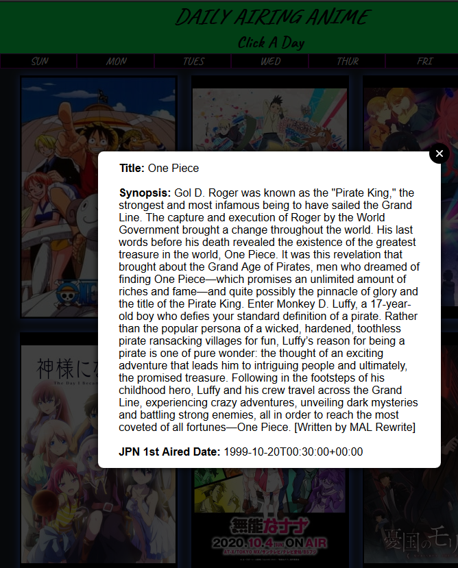

# Daily Anime

Simple web application that displays currently airing anime and the days those episodes update/air

## Technologies

- HTML5
- CSS3 
- JavaScript
- jQuery
- jQuery Modal
- Google Fonts
- CORS Anywhere Proxy
- Jikan - Unofficial MyAnimeList API

## Screenshots
Rough design layout:

Actual Web App Look:

## Getting Started
[Click Here](https://daily-anime.vercel.app/) to see the deployed app!

## Future Enhancements
- Display Genre
- Display production studios
- Display recommendations from other users
- Display current available episodes